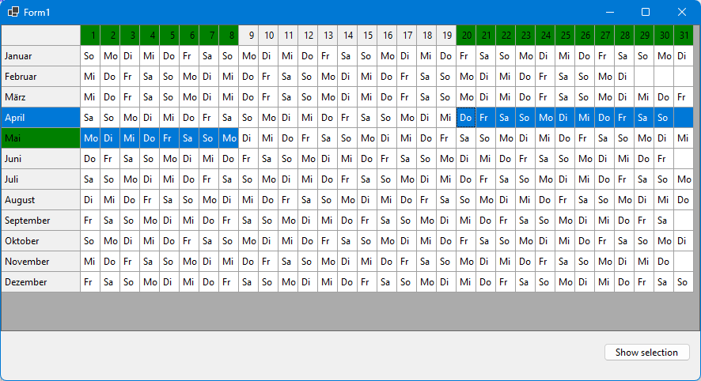
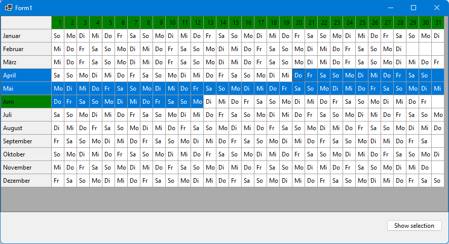
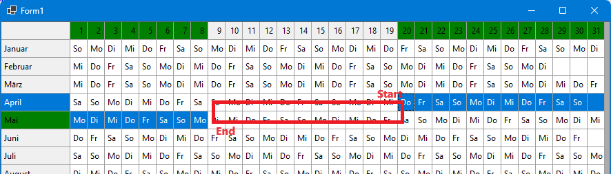
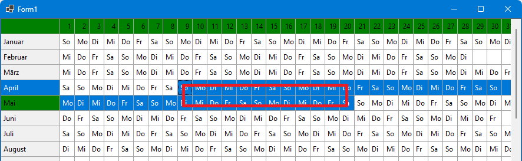

# C1FlexGrid enhancements: Calendar sheet (.NET 6)

This sample demonstrates how to create a calendar view using a ComponentOne C1FlexGrid (https://www.grapecity.com/componentone/winforms-ui-controls)

This sample uses the C1 dlls for .NET 6.

The requirement is to render a year calendar, where each month is a row and the days are columns from 1 to 31. The user should have the possibility
to select date ranges. And this is the point where it does not work with a C1FlexGrid any more: the C1FlexGrid selection modes allow only selection of rectangle cell ranges (like Excel), 
but in this  calendar application, a date range might start in one row, span to the end of the row (end of month) and continue in the next row.

A simple selection range is inside a month:

It gets interesting when selecting a range from a date in one month to the date in another month, with a column gap between them:

You can also select a range including a full month:

This sample shows how to cheat C1FlexGrid into rendering cells as "selected" that are not part of the current selection, and render selected cells as "unselected". 
This is achieved by overriding the method `bool IsCellHighlighted(int row, int col)`: it returns true if the cell should be rendered as highlighted.
Same is done for column headers: if the grid has set a style "SelectedColumnHeader" and "SelectedRowHeader", the header cells that match the highlighted cell 
must be modified by overriding bool `IsCellSelectedColumnHeader(int row, int col)`.

The main problem is to calculate the currently selected dates: the start and end cell of the selection define the start and end date of the selection. So
all cells that are between those two date values have to be rendered as "highligted". And if the selection starts in a month with less than 31 days, the remaining
empty cells should be rendered "highlighted", too.

But selections are not always from top/left to bottom/right, and this causes problems when querying the selection range from C1FlexGrid using the property "Selection":
this CellRange is normalized, so that it starts at the top left cell and ends at the bottom right cell. In my second sample, this means that the user has 
dragged a selection rectangle as show in this screenshot:

The C1FlexGrid "Selection" property is normalized, thus if you use the top left corner as start and the bottom right corner as end of the selection range,
it would result in a completely different date range: 

Fortunately, the property "Row/Col" contains the currently focused cell and "RowSel/ColSel" contains the cell where the user started selection, without normalization.
Two different combinations with two variations are possible:

* RowSel > Row and ColSel > Col: this is the easiest selection down and to the right: start month is in "Row", start day in "Col", end month in "RowSel" and end day in "ColSel".
It works also if the selection spans multiple rows.
* RowSel > Row and ColSel < Col: selection goes down and to the left: same as in previous selection.
* RowSel <= Row and ColSel < Col: the selection goes up (or in the same row) and to the left: start month is in "RowSel", start day in "ColSel", end month in "Row" and end day in "Col".
* RowSel < Row and ColSel >= Col: the selection goes up and to the right (or same col): same as in previous selection.

Now you can calculate start end end date of the selection, and the rest is easy ;-). 

Don't forget: if your code wants to read the currently selected date range, call the helper method `GetSelectedDateRange`, don't use the C1FlexGrid properties.

