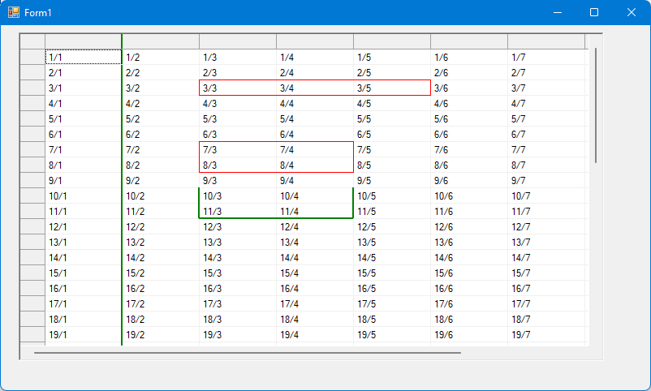

# C1FlexGrid enhancements: BorderPainter (.NET 4.8 and .NET 8)

This sample shows a way to define custom borders in a ComponentOne C1FlexGrid (https://www.grapecity.com/componentone/winforms-ui-controls)

It supports C1FlexGrid for .NET framework 4.8 and for .NET 8.

This sample is partially deprecated - since C1FlexGrid 8.0.20241.657 you can define cell borders more flexible, so that you could achieve everything that
is shown in this sample by C1FlexGrid `CellStyle`. But you will see that it is much more work to achieve the same.

## Borders in `C1FlexGrid`

### Basic borders
You create borders this way:

~~~~c#
CellStyle styleWithBorder = this.c1FlexGrid.Styles.Add("WithBorder", this.c1FlexGrid.Styles.Normal);
styleWithBorder.Border.Style = BorderStyleEnum.Flat;
styleWithBorder.Border.Color = Color.Red;
styleWithBorder.Border.Width = 2;
styleWithBorder.Border.Direction = BorderDirEnum.Both;
~~~~

This style has a border to the right and the bottom, with red lines of width "2".

Later, you apply this CellStyle to single cells:

~~~~c#
this.c1FlexGrid.SetCellStyle(row, col, styleWithBorder);
~~~~

You have to set the style to each single cell.
The border applies only to the right/bottom border of a cell. To create a top border, you have to create a style with only bottom border ("Border.Direction = BorderDirEnum.Horizontal") and set this style to the cell above the current cell.
Same for a left border: create a style with only a right border ("Border.Direction = BorderDirEnum.Vertical") and set this style to the cell left to the current cell.

This approach has the limitation that you cannot use different border types for left and bottom border of the cell.

For example, you will loose the horizontal grid line in the cell to the left border of this sample rectangle
(between cells 7/3 and 8/3):

### Borders since .657
Since `C1FlexGrid` .657, the `BorderDirEnum` enum has one more value `BothDifferent`, and you can set
different borders for right (properties `VerticalColor` and `VerticalWidth`) and bottom border (properties `HorizontalColor` and `HorizontalWidth`).

In the previous limitation sample, you have to apply the default grid border color to the horizontal border of the cell.

Here is a sample code snippet that is also used in my sample:

~~~~c#
//Right border (also used for left border of the rectangle):
CellStyle styleRightRed = this.c1FlexGrid.Styles.Add("RightRed", this.c1FlexGrid.Styles.Normal);
styleRightRed.Border.Direction = BorderDirEnum.BothDifferent;
styleRightRed.Border.VerticalColor = Color.Red;
styleRightRed.Border.VerticalWidth = 1;
//Reset horizontal border to default color, otherwise it is black:
styleRightRed.Border.HorizontalColor = styleRightRed.Border.Color;
this.c1FlexGrid.SetCellStyle(3, 2, styleRightRed);
      
//Top line of the rectangle:
CellStyle styleBottomRed = this.c1FlexGrid.Styles.Add("BottomRed", this.c1FlexGrid.Styles.Normal);
styleBottomRed.Border.Direction = BorderDirEnum.BothDifferent;
styleBottomRed.Border.HorizontalColor = Color.Red;
styleBottomRed.Border.HorizontalWidth = 1;
//Reset horizontal border to default color, otherwise it is black:
styleBottomRed.Border.VerticalColor = styleBottomRed.Border.Color;
//Bottom border of the row above the rectangle:
this.c1FlexGrid.SetCellStyle(2, 3, styleBottomRed);
this.c1FlexGrid.SetCellStyle(2, 4, styleBottomRed);
this.c1FlexGrid.SetCellStyle(2, 5, styleBottomRed);

//Bottom line of the rectangle:
this.c1FlexGrid.SetCellStyle(3, 3, styleBottomRed);
this.c1FlexGrid.SetCellStyle(3, 4, styleBottomRed);

//Right cell has bottom and right border. So it is a "Both" border:
CellStyle styleBottomRightRed = this.c1FlexGrid.Styles.Add("BottomRightRed", this.c1FlexGrid.Styles.Normal);
styleBottomRightRed.Border.Direction = BorderDirEnum.Both;
styleBottomRightRed.Border.Color = Color.Red;
styleBottomRightRed.Border.Width = 1;
this.c1FlexGrid.SetCellStyle(3, 5, styleBottomRightRed);

~~~~

There is one pitfall: in my sample, the cell left to the rectangle shall have the C1FlexGrid default grid line color.
It is not sufficient to set the `VerticalColor`, you also have to set `HorizontalColor` to the normal style border, otherwise, the default `Black` is used.

And there is a slight layout problem: you cannot draw a vertical line over some rows,
there will be a small gap at the bottom side of each cell, where the horizontal border is drawn
(it renders over the vertical line).
This issue can be resolved by using my BorderPainter (which is only a side effect :smile: ).

## Introducing "C1FlexGridBorderPainter"
To simplify this, this sample contains a helper class "C1FlexGridBorderPainter".

The result looks like this:

## Usage of "C1FlexGridBorderPainter"
To use it:
Define a membervariable of your form/usercontrol. The sample uses creates two different borders and thus creates two border painter:
~~~~c#
private C1FlexGridBorderPainter borderPainterRed;
private C1FlexGridBorderPainter borderPainterGreen;
~~~~

Initialize it somewhere in your code:
Provide the C1FlexGrid and a Pen in the constructor call.
Then, you have to tell the border painter how many rows/cols the grid has.
~~~~c#
//Create border painter with red border:
this.borderPainterRed = new C1FlexGridBorderPainter(this.c1FlexGrid, Pens.Red);
this.borderPainterRed.ResetGrid(this.c1FlexGrid.Rows.Count, this.c1FlexGrid.Cols.Count);

//Create border painter with green border and width "2 pixel":
Pen penGreen = new Pen(Color.Green, 2);
this.borderPainterGreen = new C1FlexGridBorderPainter(this.c1FlexGrid, penGreen);
this.borderPainterGreen.ResetGrid(this.c1FlexGrid.Rows.Count, this.c1FlexGrid.Cols.Count);
~~~~

If you add rows/cols to the grid or remove them, the borderpainter does not detect it itself - so call "ResetGrid" again or 
call "InsertRows"/"RemoveRows"/"InsertCols"/"RemoveCols".

If you refill the grid with different data, call "ResetGrid", which resets all borders.

Next, define some borders:

~~~~c#
this.borderPainterRed.SetBorders(3, 3, 3, 5);
this.borderPainterRed.SetBorders(7, 3, 8, 4);

//This is just a right border (which means: a vertical line)
this.borderPainterGreen.SetBorders(0, 1, this.c1FlexGrid.Rows.Count - 1, 1, BorderType.Right);

//And another partial border:
this.borderPainterGreen.SetBorders(10, 3, 11, 4, BorderType.Right | BorderType.Left | BorderType.Bottom);
~~~~

Then, active owner drawing for the grid:
~~~~c#
this.c1FlexGrid.DrawMode = C1.Win.C1FlexGrid.DrawModeEnum.OwnerDraw;
this.c1FlexGrid.OwnerDrawCell += c1FlexGrid_OwnerDrawCell;
~~~~

In event handler "c1FlexGrid_OwnerDrawCell", make the border painter calls:
~~~~c#
private void c1FlexGrid_OwnerDrawCell(object sender, C1.Win.C1FlexGrid.OwnerDrawCellEventArgs e)
{
  //First draw the cell:
  e.DrawCell();

  //Then draw our borders:
  //Note: if border from two border painter might overlap, the latest border will win:
  this.borderPainterRed.DrawBorders(e);
  this.borderPainterGreen.DrawBorders(e);
}
~~~~

## Disposing of Pen objects
If you create custom pens, you should dispose them (e.g. the green Pen in my sample). So store them in a member variable
and dispose them when the Form / UserControl is disposed.
