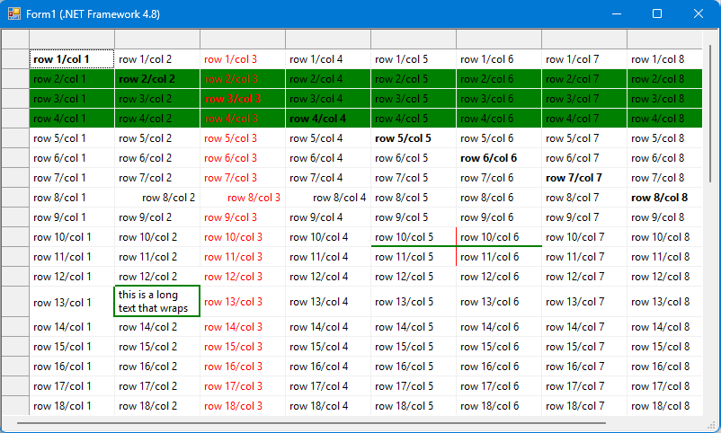

# C1FlexGrid enhancements: StyleHandler (.NET 4.8 and .NET 8)

This sample contains a helper class that simplifies cell formatting of a ComponentOne C1FlexGrid (https://www.grapecity.com/componentone/winforms-ui-controls)

It supports C1FlexGrid for .NET framework 4.8 and for .NET 8.

Normally, you set e.g. the BackColor of a cell this way:

~~~~c#
CellStyle styleWithBackColor = this.c1FlexGrid.Styles.Add("WithBackColor", this.c1FlexGrid.Styles.Normal);
styleWithBackColor.BackColor = Color.Red;
~~~~

Later, you apply this CellStyle to single cells:

~~~~c#
this.c1FlexGrid.SetCellStyle(row, col, styleWithBackColor);
~~~~

If you have a grid with a lot of colors, you have to create a style for each of them.
Combining this with ForeColor or font styles as bold or italic, you have to create a CellStyle
for each possible combination.

To simplify this, this sample contains a helper class `C1FlexGridStyleHandler`.

The sample form looks like this:

The style handler can handle those formattings:
* ForeColor
* BackColor
* Borders (style, width, color, and it is also possible to set different vertical and horizontal borders)
* Font
* TextAlign
* WordWrap
* ImageAlign
* TextDirection

## How the style handler works
The StyleHandler is just a helper class to create CellStyle objects based on a formatting.
It calculates style names based on the formatting information, checks whether a style with this name is already
contained in the grid, and adds it if not.

The style names have this structure (everything in angle brackets is a value from the CellSty,e
chars like "/" and "[" and "]" are written "as is" to the string):
~~~~
<StyleElementFlags as int>/
<BackColor>/
<BorderColor>/
<BorderDirection as int>/
<BorderStyle as int>/
<BorderWidth>/
<BorderColorVertical>/
<BorderWidthVertical>/
<BorderColorHorizontal>/
<BorderWidthHorizontal>/
<FontName>[<FontSize>]<FontStyle as int>/<ForeColor>/
<TextAlignEnum as int>/
<WordWrap>/
<ImageAlignEnum as int>/
<TextDirectionEnum as int>
~~~~

Only the modified values are contained in the string, so that it is much shorter if only the ForeColor is set.
For Borders, the string depends on the `BorderDirection`: if it is not `BothDifferent`, the values `BorderColor` and `BorderWidth` are written, but not 
`BorderColorVertical`, `BorderWidthVertical`, `BorderColorHorizontal` and `BorderWidthHorizontal`. Vice versa for `BorderDirection` = `BothDifferent`.

If you first set the ForeColor ("styleHandler.MergeForeColor"), then the font ("styleHandler.MergeFont"), actually two styles are created:  
The first style is named "4/RR,GG,BB" (where "4" is `StyleElementFlags.ForeColor`, followed by the RGB value of the color)  
The second style is named "5/RR,GG,BB/Microsoft Sans Serif,[8,25],1" (where "5" is `StyleElementFlags.ForeColor | StyleElementFlags.Font`).  
The first style might be unused.

The style handler internally builds a dictionary of style name to grid style. This is more performant then doing a lookup
in the `C1FlexGrid.Styles` collection. But it has the drawback that you should not modify the "Styles" collection
yourself, as the internal dictionary might become invalid.

## Usage of "C1FlexGridStyleHandler"
### Creation
To use it:
Define a variable anywhere (local variable in method or member variable):
~~~~c#
C1FlexGridStyleHandler styleHandler = new C1FlexGridStyleHandler(this.c1FlexGrid1);
~~~~

### Merge/Set styles
The `Merge...` methods are used if you want to combine formattings. To set BackColor and Font,
you call `MergeBackColor` and `MergeFont`. The order of those calls is not relevant.

The `Set...` methods are used, if you want to remove any formatting

In most situations, `Merge...` works perfectly, no need to use `Set...`.

Here is the code of the sample that created the screenshot:
~~~~c#
//Three rows with green backcolor
styleHandler.MergeBackColor(2, 1, 4, this.c1FlexGrid1.Cols.Count - 1, Color.Green);
//one column with red forecolor:
styleHandler.MergeForeColor(1, 3, this.c1FlexGrid1.Rows.Count - 1, 3, Color.Red);

//Some bold cells:
for (int col = this.c1FlexGrid1.Cols.Fixed; col < this.c1FlexGrid1.Cols.Count; col++)
{
  styleHandler.MergeFont(col, col, new Font(this.c1FlexGrid1.Font, FontStyle.Bold));
}

//align text vertical:
styleHandler.MergeTextAlign(8, 2, TextAlignEnum.RightCenter);
styleHandler.MergeTextAlign(8, 3, TextAlignEnum.RightCenter);
styleHandler.MergeTextAlign(8, 4, TextAlignEnum.RightCenter);

//Word Wrap:
//We have to set a longer  text:
this.c1FlexGrid1[13, 2] = "this is a long text that wraps";
styleHandler.MergeWordWrap(13, 2,true);
//AutoSizeRows is called later.

//Apply a border to this cell.
//To archive this, we have to set the bottom border of the cell above and the right border of the cell to the left.
//Unfortunately, the cell to the left looses the bottom border, and the cell above has no right border - better use my "BorderPainter" sample.
styleHandler.MergeBorder(13, 2, Color.Green, BorderDirEnum.Both, BorderStyleEnum.Flat, 2);
styleHandler.MergeBorder(12, 2, Color.Green, BorderDirEnum.Horizontal, BorderStyleEnum.Flat, 2);
styleHandler.MergeBorder(13, 1, Color.Green, BorderDirEnum.Vertical, BorderStyleEnum.Flat, 2);

//Auto size the row - do this after applying the border, as the border width "2" affects the row height:
this.c1FlexGrid1.AutoSizeRow(13);

//Set a border with "BothDifferent" direction:
//Build a "cross" with different color in horizontal and vertical bar:
styleHandler.MergeBorderBothDifferent(10, 5, BorderStyleEnum.Flat, Color.Green, 2, Color.Red, 1);
//Vertical border shall be the normal style border here:
styleHandler.MergeBorderBothDifferent(10, 6, BorderStyleEnum.Flat, Color.Green, 2, this.c1FlexGrid1.Styles.Normal.Border.Color, this.c1FlexGrid1.Styles.Normal.Border.Width);
//The bottom line just has a vertical border, the bottom horizontal border is the grid line style:
styleHandler.MergeBorderBothDifferent(11, 5, BorderStyleEnum.Flat, this.c1FlexGrid1.Styles.Normal.Border.Color, this.c1FlexGrid1.Styles.Normal.Border.Width, Color.Red, 1);
~~~~
