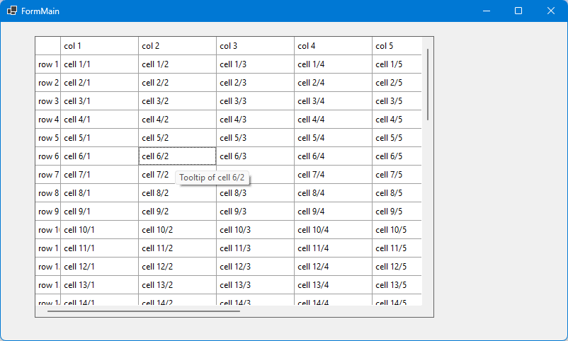

# C1FlexGrid enhancements: ToolTip per cell (.NET8)

This sample contains a helper class that makes it possible to show tooltips for single cells of a ComponentOne C1FlexGrid (https://www.grapecity.com/componentone/winforms-ui-controls). 

This sample targets .NET8. 

## The sample

The main form of the sample contains a C1FlexGrid. With the help of a component `FlexGridToolTipRequester` a custom tooltip is shown
for each cell of the grid.

The tooltip is hidden when the cursor moves to another cell, and after a short delay, the tooltip for the new cell is shown. So there is no permanent
tooltip sticking to the mouse, as would happen if you used a `System.Windows.Forms.ToolTip` component which just shows a tooltip for the entire grid.

## How it works

Whenever the mouse is moved, the `FlexGridToolTipRequester` sends the event `ToolTipRequest` to request the tooltip text 
for the current cursor position. The event args of this event contain the current cursor position.
  
The event handler determines the grid cell (by using `C1FlexGrid.HitTest`) and sets the tooltip text for this cell and also a "hint" object.
This object is a info about the current cell (or cell range) that defines a tooltip.
Whenever this hint changes, the tooltip is reshown.

"Reshown" means here: a timer is started that ticks after 100ms (`ToolTip.ReshowDelay`). Now the tooltip is triggered to be shown, which happens after `ToolTip.InitialDelay`.

*I am not sure whether this internal timer is really required - I created this sample based on old code, and I am not sure whether it would also work without the timer.*

Common usage: if you want to show tooltips per cell, just set e.g. a `C1.Win.FlexGrid.CellRange`
object (or a `System.Drawing.Point`) which identifies a single cell.
But you could also create a tooltip for all cells of a column by setting the column index as "Hint".
You could event create different tooltips for different parts of the same cell - you just have to set a unique "Hint".

## How to use it
* In WinForms Designer toolbox, a `FlexGridToolTipRequester` component is shown. Place it on a form. 
* Then assign a C1FlexGrid instance on your form to the property `ControlForToolTip`.
* Handle the event `ToolTipRequest`, which is raised whenever the mouse is moved.

This is the sample code for this event handler:

~~~~c#
private void toolTipRequester_ToolTipRequest(object sender, ToolTipRequestEventArgs e)
{
  //Get cell for mouse position:
  Point p = new Point(e.X, e.Y);
  HitTestInfo hti = this.c1FlexGrid.HitTest(p);
  
  //Set the cell range as hint - so the tooltip is shown only once per cell.
  e.Hint = this.c1FlexGrid.GetCellRange(hti.Row, hti.Column);

  //Generate a tooltip:
  e.ToolTipText = "Tooltip of cell " + hti.Row + "/" + hti.Column;
}
~~~~

## Configuration

You can set the AutoPopDelay of the tooltip (after this period it is hidden), see https://learn.microsoft.com/en-us/dotnet/api/system.windows.forms.tooltip.autopopdelay
The default is "5000".

It should be easy to add the other delay properties of the internally used `ToolTip` ;-)