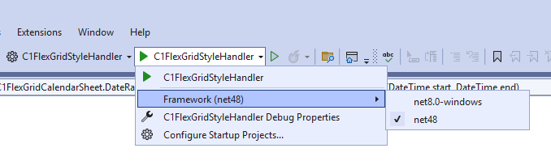

# C1FlexGrid enhancements

This repository contains some enhancements to ComponentOne C1FlexGrid (https://www.grapecity.com/componentone/winforms-ui-controls)

Each sample project contains two target frameworks (.NET 4.8 and .NET 8).

When launching the sample, you select the target framework here:

## C1FlexGridBorderPainter
The sample [C1FlexGridBorderPainter](/C1FlexGridBorderPainter) contains a helper class that simplifies the drawing of borders in C1FlexGrid.

## C1FlexGridStyleHandler
The sample [C1FlexGridStyleHandler](/C1FlexGridStyleHandler) contains a helper class that simplifies the formatting of cells in a C1FlexGrid 
by using styles

## Copy to Office
The sample [Copy to Office](/C1FlexGridCopyOffice) contains a helper class that shows how to write the C1FlexGrid 
content to the clipboard so that it can be pasted to Word/Excel/Outlook and the formatting is kept.  
The same code can also be used to export a C1FlexGrid to Html.

## Calendar sheet
The sample [Calendar sheet](/C1FlexGridCalendarSheet) shows how to render a calendar table with month rows and day columns
and select date ranges, which requires a bar selection instead of the rectangle selection of C1FlexGrid.

## AutoSizeRows mode "Height to last"
The sample [AutoSizeRows: Height to last](/C1FlexGridAutoSizeRowHeightToLast) shows an optimized `AutoSizeRows` mode for multi row merged
ranges, so that the first rows of the range are not higher than necessary.

## FlexGridToolTipRequester
The sample [FlexGridToolTipRequester](/C1FlexGridToolTipRequester) shows how to display a custom tooltip for each cell of the grid.
